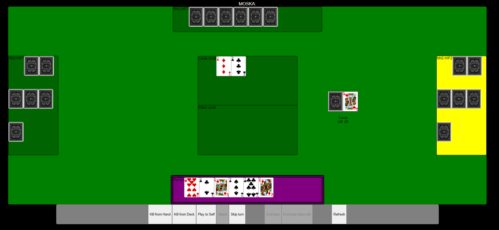

## Moska web application
This repository contains a web application for the finnish 'Moska' card game.

*Figure 1. Currently the application only supports play against three AI players.*

The game engine is [MoskaEngine](https://github.com/ilmari99/MoskaEngine) written in Python.