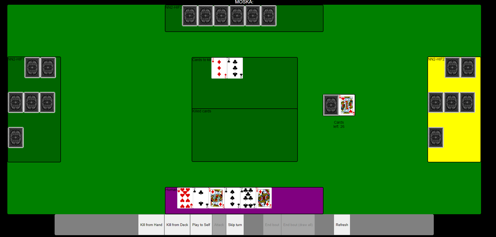

## Moska web application
This repository contains a web application for the finnish 'Moska' card game.


*Figure 1. Currently the application only supports play against three AI players.*

The game engine is [MoskaEngine](https://github.com/ilmari99/MoskaEngine) written in Python.

## Usage
To run the web application, you need: Node.js, npm, Git, Python (>=3.6 but <3.11), and MoskaEngine (0.1.10).
In addition, you need a highly confidential `.env` file, which contains information about the database connection.

### Install node and npm
See https://nodejs.org/en/download/

#### With Ubuntu
```
curl -o- https://raw.githubusercontent.com/nvm-sh/nvm/v0.35.3/install.sh | bash

source ~/.bash_profile

nvm install node

npm install -g nodemon
```


Confirm succesful installation by running
```
node --version
>> v20.x.x
npm --version
>> 9.x.x
```

### Install Python
See https://www.python.org/downloads/
Confirm succesful installation by running:
```
python3 --version
>> Python 3.6.x (or newer <3.11.x)
```

### Install Git
See https://git-scm.com/book/en/v2/Getting-Started-Installing-Git

Confirm succesful installation by running:
```
git --version
```

### Clone the repository to your local machine and navigate to the project folder
```
git clone https://github.com/LeeviKamarainen/Moska.git
cd Moska
```

### (Optional) Create and activate a virtual environment
#### With Ubuntu
```
python3 -m venv .venv
source .venv/bin/activate
```

#### With Windows
```
py -m venv .venv
.venv\Scripts\activate
```

### Install MoskaEngine with pip
```
pip install moskaengine
# Make sure the version is 0.1.10
pip list | grep moskaengine
```

### Install dependencies
```
npm install
# If there are problems,try running
npm audit fix
npm audit fix --force
```

### Start the application
```
npm start
```

Open http://localhost:3000/ in your browser.